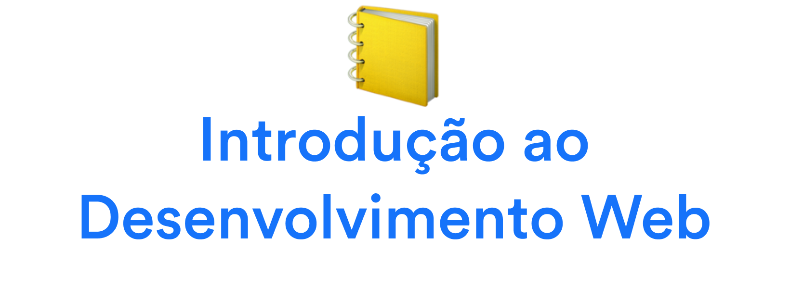

# Aula 2

## Atividade

A atividade desta aula é a mais básica possível mas que fará cada vez mais sentido conforme o tempo passar. Selecione seu site preferido da internet – sem julgamentos! Tire um screenshot da principal forma que você utiliza.

E agora, a atividade é **observar** e **relatar**.

- [ ] Qual é a forma que você costuma acessar este site? Desktop, celular, tablet? Em qual sistema operacional? Em qual navegador?
- [ ] Este site possui um aplicativo que você pode baixar? Você utiliza o app?
- [ ] Qual a funcionalidade predileta deste site?
- [ ] Qual é a sua percepção de velocidade? Carrega rápido? 
- [ ] Tente acessar este site de formas diferentes do habitual. Em outros navegadores, etc. Há alguma diferença?
- [ ] Clique com o botão direito do mouse no Desktop acessando esse site e selecione a opção de exibir o código-fonte. Dê uma olha, consegue se encontrar? Ou está tudo "bagunçado"?
- [ ] Se você usar apenas `tab` e não usar o mouse, você consegue navegar nesse site? Consegue acessar um link ao clicar em `enter`?
- [ ] Você se lembra deste site ter ficado indisponível em algum momento?
- [ ] E um site que você lembra algum desprazer ou mais experiêcia. Qual foi e por quê?

Suas respostas vão ser úteis no futuro quando iniciarmos nossa jornada do desenvolvimento web e poderemos revisitar essas anotações e entender tudo (ou quase tudo) que está acontecendo! Por favor, as incluam no canal adequado de sua turma!

## Referências

- [O primeiro website](http://info.cern.ch/hypertext/WWW/TheProject.html)
- [Guerra dos navegadores](https://pt.wikipedia.org/wiki/Guerra_dos_navegadores)
